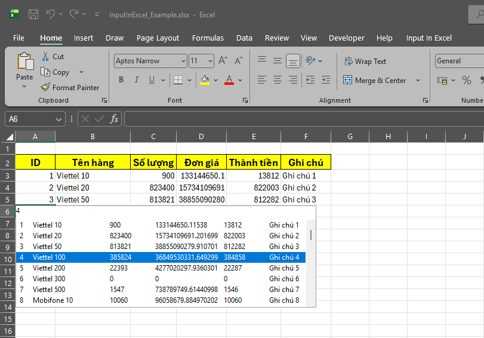
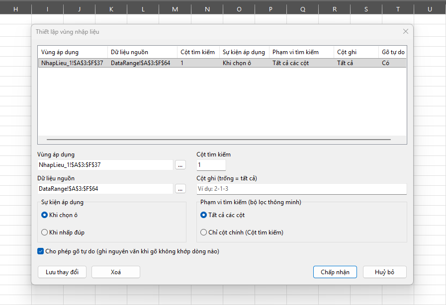
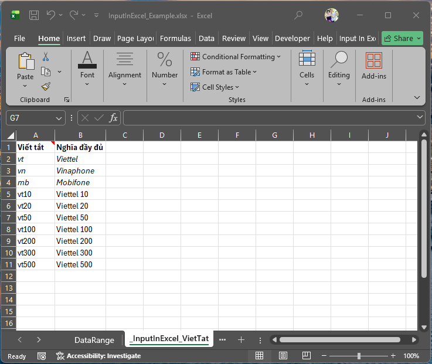

# InputInExcel

> **Add-in Excel giúp nhập liệu nhanh và chính xác từ danh mục có sẵn. Gõ để tìm, chọn để nhập.**

InputInExcel là add-in dạng XLL cho Microsoft Excel, hiển thị popup gợi ý ngay tại ô đang nhập, giúp bạn nhanh chóng chọn giá trị từ một vùng dữ liệu tham chiếu (danh mục sản phẩm, khách hàng, mã hàng...) thay vì gõ tay hoặc tìm kiếm thủ công.

Khi người dùng gõ ký tự, danh sách sẽ được lọc ngay theo từ khóa. Hỗ trợ chọn bằng chuột hoặc phím mũi tên lên/xuống, sau đó nhấn Enter để nhập dữ liệu vào ô đang chọn trong Excel.

Không giống các giải pháp sử dụng hộp thoại nhập liệu riêng, Add-in hiển thị popup gợi ý ngay tại ô đang chọn trong Excel. Người dùng chỉ cần gõ để tìm, chọn để nhập, mang lại trải nghiệm nhập liệu tự nhiên, nhanh và liền mạch như một phần của Excel.

---

## Ảnh chụp màn hình

   
  Popup gợi ý hiện ngay tại ô đang nhập, lọc theo từ khóa gõ vào

   
  Form cấu hình vùng nhập liệu: vùng áp dụng, dữ liệu nguồn, cột tìm kiếm, cột ghi...

   
  Tự định nghĩa từ viết tắt riêng, gõ tắt vẫn tìm ra đúng dữ liệu đầy đủ

---

## Tính năng

- **Bộ lọc thông minh nhiều cột**: gõ 1 vài ký tự, tự động tìm khớp trên nhiều cột cùng lúc (không cần đúng thứ tự, không cần đúng cột), xếp hạng kết quả theo mức độ khớp.
- **Từ viết tắt**: tự định nghĩa các từ viết tắt riêng (ví dụ `vt` → `Viettel`), gõ tắt vẫn tìm ra đúng dữ liệu đầy đủ.
- **Cột ghi tùy chọn**: chọn đúng cột nào cần ghi vào bảng tính, theo đúng thứ tự mong muốn, không bắt buộc ghi toàn bộ dòng dữ liệu nguồn.
- **Gõ tự do (free-text fallback)**: nếu gõ không khớp dữ liệu nào, vẫn có thể ghi thẳng nội dung vừa gõ (tùy chọn bật/tắt riêng cho từng vùng nhập liệu).
- **Cấu hình linh hoạt**: mỗi vùng nhập liệu (rule) có thể tùy chỉnh: vùng áp dụng, dữ liệu nguồn, cột tìm kiếm, phạm vi tìm kiếm (toàn bộ cột hoặc chỉ cột chính), sự kiện kích hoạt (khi chọn ô / khi nhấp đúp).

---

## Yêu cầu hệ thống

- Windows
- Microsoft Excel (bản 32-bit hoặc 64-bit, xem hướng dẫn kiểm tra bên dưới)

---

## Tải xuống

| File | Mô tả |
|---|---|
| `InputInExcel32.xll` | Add-in dành cho Excel **32-bit** |
| `InputInExcel64.xll` | Add-in dành cho Excel **64-bit** |
| `InputInExcel_Example.xlsx` | File Excel mẫu, có sẵn dữ liệu và cấu hình để dùng thử ngay |

**Kiểm tra Excel của bạn đang là bản 32-bit hay 64-bit:**
Mở Excel → `File` → `Account` → `About Excel`, dòng đầu tiên sẽ ghi rõ *32-bit* hoặc *64-bit*.

> Lưu ý: bit của Excel (Office) không phụ thuộc bit của Windows, máy Windows 64-bit vẫn có thể đang cài Excel bản 32-bit.

---

## Cài đặt

1. Tải file `.xll` đúng với phiên bản Excel của bạn (xem bảng trên).
2. Mở Excel → `File` → `Options` → `Add-ins`.
3. Ở mục **Manage**, chọn **Excel Add-ins** → bấm **Go...**
4. Bấm **Browse...**, chọn file `.xll` vừa tải → **OK**.
5. Add-in tự đăng ký và sẵn sàng dùng ngay, không cần khởi động lại Excel, không cần quyền quản trị máy.

Sau khi cài xong, 1 nhóm nút mới sẽ xuất hiện trên tab **Home** của Ribbon.

---

## Dùng thử nhanh

Mở file mẫu **`InputInExcel_Example.xlsx`** đi kèm, file đã có sẵn dữ liệu và cấu hình mẫu, chỉ cần click vào các ô đã thiết lập để thấy popup gợi ý hoạt động ngay.

---

## Hướng dẫn sử dụng

Trên tab **Home**, nhóm **"Nhập liệu từ danh mục"**:

- **Từ viết tắt**: mở/ẩn Sheet cấu hình danh sách từ viết tắt (bấm lần 1 để mở, bấm lần 2 để ẩn lại).
- **Nhập liệu**: bật/tắt toàn bộ tính năng popup gợi ý.
- **Thiết lập**: mở Form cấu hình vùng nhập liệu: thêm/sửa/xóa rule, chọn Vùng áp dụng, Dữ liệu nguồn, Cột tìm kiếm, Cột ghi, Sự kiện áp dụng, Phạm vi tìm kiếm, Cho phép gõ tự do.
- **Ủng hộ**: xem thông tin ủng hộ tác giả.
- **Hỗ trợ**: mở trang này để xem thêm hướng dẫn.

---

## Liên hệ / Hỗ trợ

**Kiều Mạnh**
Điện thoại: 0929 278 279 - 0929 278 379
Email: <kieumanh366377@gmail.com>

Gặp lỗi hoặc có góp ý, vui lòng tạo [Issue](https://github.com/KieuManh366377/InputInExcel/issues) trên GitHub hoặc liên hệ trực tiếp qua thông tin trên.
